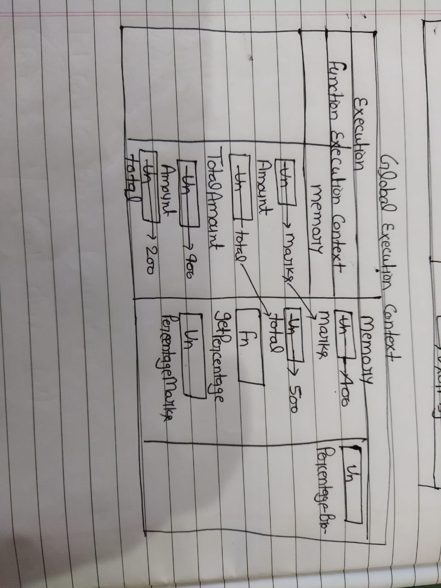
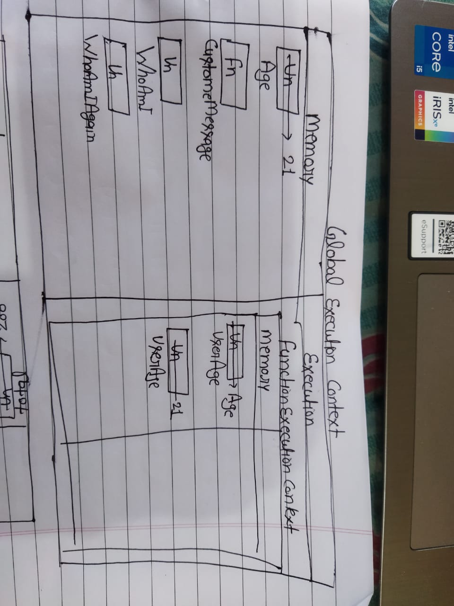
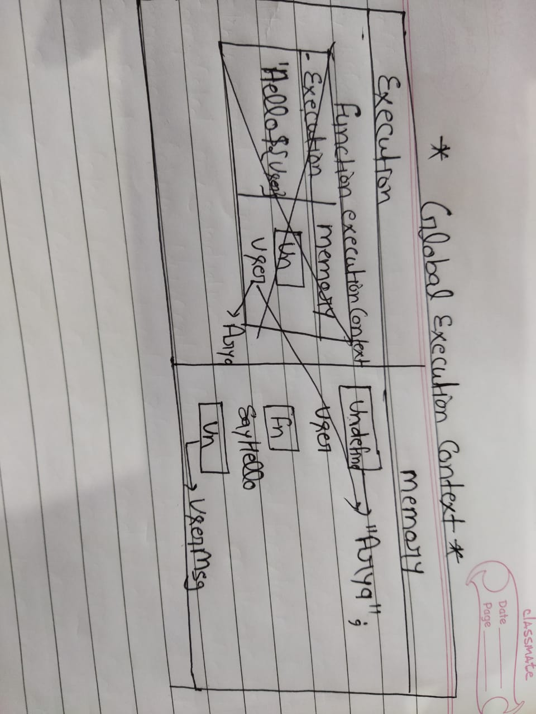

1. What does thread of execution means in JavaScript?

 In this phase, the JavaScript code is executed one line at a time inside the Code Component (also known as the Thread of execution) of Execution Context.

2. Where the JavaScript code gets executed?

Everything in JavaScript happens inside an "Execution Context”. Whenever a JavaScript program is run an execution context is created. In this phase, javascript allocates the memory to all the variables and functions present in the program

3. What does context means in Global Execution Context?

Execution context (EC) is defined as the environment in which the JavaScript code is executed. By environment, I mean the value of this , variables, objects, and functions JavaScript code has access to at a particular time.


4. When do you create a global execution context.

Whenever the JavaScript engine receives a script file, it first creates a default Execution Context known as the Global Execution Context (GEC) . The GEC is the base/default Execution Context where all JavaScript code that is not inside of a function gets executed. For every JavaScript file, there can only be one GEC.

5. Execution context consists of what all things?

execution context make memmory and execution phase ;

6. What are the different types of execution context?

During the Execution Context run-time, the specific code gets parsed by a parser, the variables and functions are stored in memory, executable byte-code gets generated, and the code gets executed. There are two kinds of Execution Context in JavaScript: Global Execution Context (GEC) Function Execution Context (FEC)

7. When global and function execution context gets created?

global execution context       function execution context
It creates a global scope.	It creates an argument object.
It creates an object known as 'this.'	It points to the Window object by default

8. Function execution gets created during function execution or while declaring a function.


9. Create a execution context diagram of the following code on your notebook. Take a screenshot/photo and store it in the folder named `img`. Use `` to display it here.


```js
var user = "Arya";

function sayHello(){
  return `Hello ${user}`;
}

var userMsg = sayHello(user);
```

<!-- Put your image here -->





```js
var marks = 400;
var total = 500;

function getPercentage(amount, totalAmount){
  return (amount * 100) / totalAmount;
}

var percentageMarks = getPercentage(marks, total);
var percentageProfit = getPercentage(400, 200);
```

<!-- Put your image here -->


;


```js
var age = 21;

function customeMessage(userAge){
  if(userAge > 18){
    return `You are an adult`;
  }else {
    return `You are a kid`;
  }
}

var whoAmI = customeMessage(age);
var whoAmIAgain = customeMessage(12);
```

<!-- Put your image here -->


;